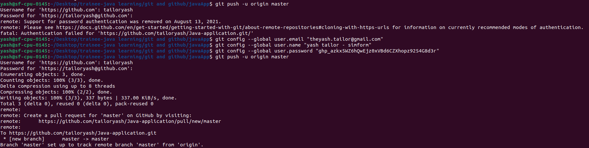

# GIT Assignments

## Assignment -1 

Problem Definition

- Create a demo java application.

- Commit application to GitHub account
 

- Create a branch and make changes and commit changes in the branch

- Create a pull request and merge it with the master branch

## END
